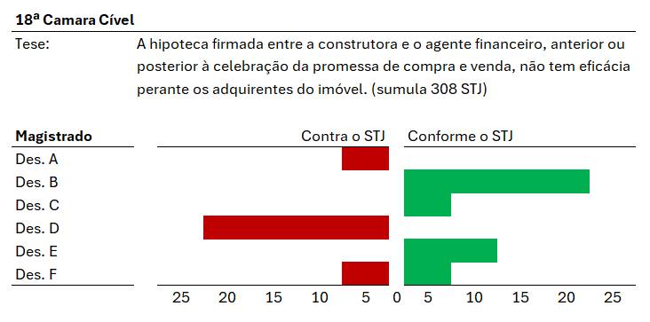

Este repositório contém o trabalho de produção de um relatório jurisprudencial para o Grupo Temático de Crédito Imobiliário da Comissão de Direito Imobiliário e da Construção Civil da Seção do Paraná da Ordem dos Advogados do Brasil.

# Introdução

O objetivo é produzir um relatório replicável de informações sobre a posição jurisprudencial do TJPR sobre determinados temas envolvendo crédito imobiliário. A função do relatório é permitir identificar a pacificação e percolação dos precedentes definidos pelo STJ no âmbito da corte estadual, analisando a posição de cada julgado em relação às teses fixadas pelo STJ. A metodologia deve ser clara, objetiva e replicável para facilitar a manutenção do relatório. Tanto para obtenção dos dados quanto para a produção do relatório, serão adotadas tecnologias para reduzir o trabalho manual, servindo para as possibilidade de utilização da tecnologia para o dia a dia do advogado.

No resultado do relatório será possível apurar:

-   A. (primário) Acórdãos do TJPR contrarios às teses do STJ (agravo e apelação);

-   B. (secundário) Decisões monocráticas da Vice Presidência em juízo de admissibilidade em REsp nas decisões identificadas como contrárias às teses do STJ;

Esboço do relatório final:

O numeros representam a quantidade de decisões de cada magistrado.

> Notas:

> a execução do Item B partiria apenas dos casos em que o julgado foi contrário à posição do STJ. Isto se dá porque a base de jurisprudência do TJPR não contém as decisões de admissibilidade. Será necessário entrar no processo e identificar se houve REsp e qual foi a decisão da Vice Presidência.

> a apuração das posições deverá adotar um dos critérios: (i) magistrado como relator; ou (ii) magistrado como integrante do julgado. Esta segunda posição implica num volume de trabalho manual maior, pois o dado não esta estruturado na base do TJPR, contudo, deixa o relatório muito mais robusto e completo.

# Cronograma e estrutura

## 1. Definição de parâmetros de pesquisa (até 27/03):

-   [x] Definir as teses (aquisição, construção/incorporação, locação);
-   [x] Definir os verbetes;
-   [ ] Definir o formato do relatório;
-   [ ] Definir os dados que serão analisados;
-   [ ] Definir se a posição do magistrado será computada apenas quando este for o relator ou não (esta definição é crucial, pois vai impactar no volume de trabalho);
-   [ ] Definir se serão adotados apenas precedentes qualificados ou não;

## 2. Obtenção dos dados (até 18/04):

-   Dados com acessibilidade (até 03/04):
    -   [ ] Produzir um script de obtenção dos dados (R ou pyhon);
    -   [ ] Executar o script e obter os dados;
    -   [ ] Criar um dataframe com os dados obtidos;
    -   [ ] Criar um arquivo de armazenagem dos dados (json);
-   Dados sem acessibilidade (até 18/04):
    -   [ ] Dos julgados obtidos, obter dados complementares;
    -   [ ] Criar um novo arquivo de armazenagem dos dados;

## 3. Refinamento dos dados (até 26/04):

-   [ ] Incluir dados complementares da base de dados;
-   [ ] Identificar erros nos dados e ajustar;

## 4. Produção do relatório (até 31/04):

-   [ ] Produzir o relatório;

# Parâmetros
Para a execução do relatório foram definidos os seguintes parâmetros:

Tema| Verbetes
---| ---
indexador monetário | "imóvel", "substituição" , "IGP-M", "IGPM", "IPCA"
garantias locatícias | "locação", "garantia", "substituição", "despejo"

Quanto ao primeiro tema, o objetivo é identificar a posição do TJPR quanto à modificação do indexador monetário contratual no período dos últimos 8 anos.
Isto permite analisar os efeitos da pandemia de COVID-19.

Quanto ao segundo tema, o objetivo é identificar a posição do TJPR quanto à aplicação da norma que permite o despejo liminar.
Serão observados os acórdões proferidos em agravos de instrumento contra as decisões liminares, especialmente nos casos onde houve extinção da garantia no curso do contrato.
Esta definição permitirá observar os efeitos dos modelos de negócio das staratups que fornecem garantias locatícias, identificando se a presença do modelo produz alguma alteração no cumprimento do despejo.

# Notas
## Como funciona o processo de manipulação de dados?
O processo de manipulação de dados inclui seis etapas principais: explorar, transformar, limpar, enriquecer, validar e armazenar.

1. **Explorar**: a exploração ou descoberta de dados é uma forma de identificar padrões, tendências e valores ausentes ou incompletos em um conjunto de dados. Grande parte da exploração acontece antes da produção de relatórios, visualizações de dados ou treinamento de modelos, mas também é comum observar detalhes surpreendentes e insights inéditos durante a análise do conjunto de dados.

2. **Limpar**: muitas vezes, as informações contêm erros causados por entrada manual, dados incompletos, coletados automaticamente por meio de sensores ou até mesmo por falhas nos equipamentos. A limpeza de dados corrige essas discrepâncias, eliminando duplicatas e outliers (se necessário), além de excluir dados ausentes e atribuir valores faltantes com base na modelagem estatística ou condicional para aprimorar a qualidade das informações.

3. **Transformar**: a transformação ou estruturação de dados é fundamental. Caso contrário, pode comprometer o restante do processo em andamento. Para isso, é necessário definir o tipo e o formato dos dados adequados para a criação de relatórios, visualizações, processos analíticos ou modelos. É possível ainda incluir novas variáveis (também conhecidas como características) e executar funções estatísticas sobre os dados.

4. **Enriquecer**: o enriquecimento ou a combinação torna um conjunto de dados mais valioso ao incorporar fontes adicionais como estatísticas confiáveis de terceiros, dados firmográficos ou demográficos. O processo de enriquecimento também ajuda a revelar insights adicionais sobre uma empresa ou desencadear novas ideias de coleta e armazenamento de informações dos clientes no futuro. Essa é a oportunidade ideal para refletir de forma estratégica sobre os dados complementares que podem contribuir para criar relatórios, modelos ou processos de negócio.

5. **Validar**: as regras de validação são sequências de programação repetitivas que verificam a consistência, qualidade e segurança dos dados. Exemplos de validação incluem garantir a distribuição uniforme de atributos que deveriam ser distribuídos normalmente (por exemplo, datas de nascimento) ou confirmar a acurácia dos campos por meio da verificação dos dados. Essa é uma etapa vital no processo de organização de dados.

6. **Armazenar**: a última parte do processo consiste em armazenar ou preservar o produto final, além de todas as etapas e transformações realizadas com o objetivo de garantir o controle, compreensão e reprodução posterior.

## Benefícios da manipulação de dados
A manipulação de dados facilita a análise e interpretação das informações, o que traz muitos benefícios, incluindo:

1. **Maior clareza e compreensão**: se você já encontrou dados desorganizados ou um grande conjunto de dados que não é fácil de interpretar, você entende o problema que surge por não ser capaz de entender o que os dados representam e para que podem ser usados. Conjuntos de dados manipulados adequadamente podem ser usados mais facilmente para gerar relatórios no Tableau e outras ferramentas de visualização de dados.

2. **Consistência dos dados**: como as empresas usam com frequência dados de múltiplas fontes, incluindo terceiros, os dados com frequência incluem diversos erros. Uma etapa importante no processo de manipulação de dados é a criação de conjuntos consistentes que ajudam a eliminar erros introduzidos por humanos e por diferentes padrões de formatação de terceiros, resultando em melhor acurácia durante a análise.

3. **Maior acurácia e precisão dos dados**: a forma como os dados são manipulados e organizados pode afetar a acurácia e a precisão da análise, especialmente quando se trata de identificar padrões e tendências relevantes. Exemplos de boa manipulação de dados incluem organizar dados por dados numéricos em vez de valores categóricos ou organizar dados em tabelas em vez de colunas. Agrupar dados semelhantes melhora a acurácia.

4. **Melhor comunicação e tomada de decisões**: maior clareza e melhor acurácia reduzem o tempo que outras pessoas precisam para compreender e interpretar os dados, levando a uma melhor compreensão e comunicação entre as equipes. Esse benefício pode levar a maior colaboração, transparência e melhores decisões.

5. **Melhor relação custo-benefício**: reduzir erros, organizar dados e aumentar a colaboração levam a um uso mais eficiente do tempo, economizando dinheiro para as organizações. Por exemplo, dados limpos e cuidadosamente organizados reduzem erros e economizam tempo dos desenvolvedores ao criar relatórios ou modelos de machine learning. Conjuntos de dados consistentes tornam mais fácil para os cientistas de dados reutilizar algoritmos nos seus modelos ou aplicar novos por meio da data science e do machine learning automatizado.

# Referências
